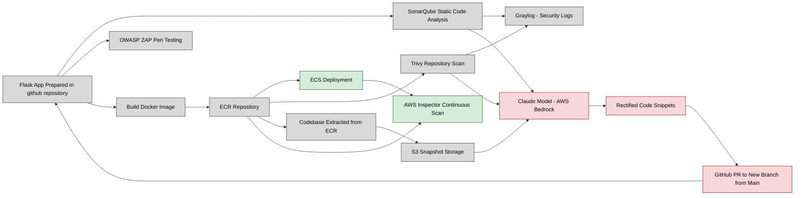

# DevSecOps-Container-Remediation-Project

This project shows how we can build software (based on microservice architecture like using the help of docker tool) securely from the very beginning. Instead of waiting until the end to check for problems, we scan, test, and fix code at every step. That way, security issues are caught early and fixed automatically, reducing the burden on operations teams later.

**NOTE:YOU CANNOT RUN THIS GITHUB ACTIONS WORKFLOW FILE SINCE THAT WOULD REQUIRE YOU TO CONFIGURE YOUR OWN GITHUB SECRETS**

For a detailed technical breakdown of tools and metrics, see: **[technicalreport.md](https://github.com/devjoshi2005/DevSecOps-Container-Remediation-Project/blob/main/technicalreport.md)**

**Think of this project like building a house with smart security built in:**

*Before moving in (Pre‑remediation):* We check the blueprints (code scans), test the doors and windows (penetration testing), and make sure the building materials are safe (container scans).

*During construction (Remediation):* If problems are found, an AI “expert builder” (Claude via AWS Bedrock) suggests fixes and even prepares the corrected parts for us. These fixes are proposed as pull requests in GitHub, so humans can review before merging.

*After moving in (Post‑remediation):* Continuous inspections (AWS Inspector) keep checking the house for cracks or weaknesses over time, so we don’t get caught off guard later.

**Step‑by‑Step (Layman’s View):**

Build a sample app: A simple Flask web app is created and packaged into a container (like boxing up the app so it can run anywhere).

Run safety checks on the code:

SonarQube looks at the code itself for bugs.

OWASP ZAP pretends to be a hacker and attacks the app to see if it breaks.

Store the app safely: The app is stored in AWS ECR (a secure warehouse for containers) and deployed to ECS (a service that runs those containers).

Scan the container: Trivy checks the container for known vulnerabilities (like checking ingredients for expiry dates).

Collect reports: Results from SonarQube and Trivy are sent to Graylog, which acts like a central dashboard for all findings.

Prepare for fixes: The app’s code is extracted from ECR and stored in S3 (a simple storage bucket).

AI‑powered remediation: The code, along with scan reports, is sent to Claude (via AWS Bedrock). Claude suggests fixes for the vulnerable parts of the code.

Propose changes: Claude creates a new branch in GitHub and opens a pull request with the suggested fixes. Developers can review and merge if they agree.

Ongoing monitoring: AWS Inspector continuously scans the containers in ECR to catch new vulnerabilities that might appear in the future.

**Why This Matters:** 

*For developers:* Problems are caught early, saving time and frustration.

*For security teams:* Automated scanning and AI remediation reduce manual workload.

*For businesses:* Faster fixes mean less downtime, lower risk, and better compliance with security standards.

