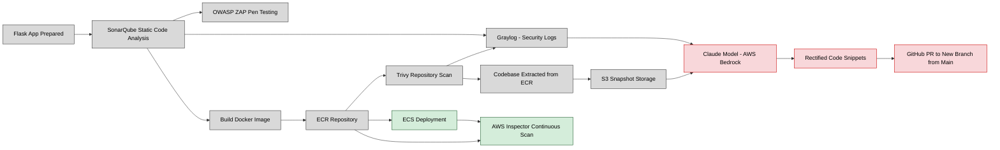

# DevSecOps-Container-Remediation-Project

# This file covers the upper layer of process of my project
# For indepth technical report of each tools and metrics: Visit technicalreport.md

In real life, while developing microservice based (using docker) applications . Its important to check for any vulnerabilties which causes serious issues now or later during the deployment of the application.Hence, it is important to follow security along devops process hence (devsecops) ie: developing applications step by step while doing continuous integration and continuous deployment with security scans of each code snippets. So that overhead of maintaining and resolving security issues for operation department gets reduced.This is the overall idea of my project "DevSecOps Container Remediation Pipeline with AWS Inspector" that does the following:-

1) Creating a demo flask application := for the process showcase, I have developed a sample flask application with html/css as frontend that will be built into a docker image and stored in Elastic container registry (ECR) (used for storing container images) and then Elastic container service (ECS) (used to store these images as containers for further development use) . Using github actions (used for automated tasks integral part of devsecops process. the following tasks given below would be automated )

2) OWASP ZAP Security Scan := when flask app is test deployed. using the localhost link (private test link of our app) the app is scanned by method of automated penetration runtime testing . where our app is runned and every type of numerous sample code attacks are being done for every feature of our application. then it sends a report covering vulnerabilities present in each of our app features

3) Sonarqube Code Scan := after successful flask app development, its time to check for security bugs present in our codebase using the tool called sonarqube (used for static code analysis ie : scan for security bugs before running the code). that helps to find any problems before the deployment stage itself

4) Deploy to ECR + ECS := the codebase is built into docker image and later published to ECR as storage for container images and later deployed to ECS as container for further development

5) Trivy scan := Trivy is a vulnerability scanner used to detect security misconfigurations like open secrets , CVE's during build of container image.It is essential for devsecops process (ie: CI/CD and gatekeeping scan for our container security)

6) Sonarqube and Trivy report sent to Graylog := Graylog is a popular log management and security analytics software company and is important especially for the devsecops process. Now sonarqube report (ie: bugs,qualitygate,projectkey and timestamp) and Trivy's report (ie: critical,high,image,timestamp) to graylog's dashboard for log collection

7) Codebase from ECR extracted to s3 bucket := for code remediation, the codebase will be extracted from image stored in ECR. to be stored in s3 (simple storage service) bucket to be later sent to claude sonnet 3 model (ai model popularly used for coding) called via aws bedrock in form of s3 uri link

8) Sonarqube,Trivy messages and s3 URI are sent to claude sonnet 3 model := Using github actions, sonarqube and trivy messages along with s3 URI link (full codebase for ai model to understand) is sent to claude sonnet 3 model called using aws bedrock authentication that helps us to remediate vulnerable code snippets (small parts of code that matters the most) only.

9) claude sonnet model sends remediated code snippets to our github repository := after code remediation, the ai model will send remediated code snippets to our github repository by first creating a new branch out of our default main branch and then sending PR request to our newly created branch (basically providing remediated code and asking to us the request to modify our original codebase)

10) AWS inspector scan := AWS inspector is a tool helpful for continous container security scan that scans our ECR and its images stored inside for continous CVE's or misconfigs that would later be found in the future.

