# Technical Report of DevSecOps-Container-Remediation-Project

DevSecOps‑Container‑Remediation‑Project is an end‑to‑end pipeline that integrates secure software development, automated build and deployment, continuous security scanning, centralized observability, and AI‑assisted remediation. The pipeline turns developer commits (Flask + HTML/CSS microservice) into immutable container artifacts, continuously evaluates them with static and runtime scanners, and closes the loop by producing human‑reviewable remediation pull requests generated by an LLM (Claude Sonnet via AWS Bedrock). The design emphasizes least‑privilege automation (GitHub OIDC → AWS roles), reproducible artifacts, auditability, and a human‑in‑the‑loop approval model for all automated code changes.


*Step by Step Execution of this project*

```mermaid
flowchart LR
    A[Step1 : Flask App Prepared in github repository]:::code --> B[Step2 : Owasp Zap Scanning is done on the application]:::zap
    B --> C[Step3 : Sonarqube static code analysis is done]:::sonar
    C --> D[Step4 : Built into docker image and later pushed to ECR and later ECS]:::docker
    D --> E[Step5 : Trivy scans the image pulled from the ECR for misconfigurations,secrets or CVE'S ]:::trivy
    E --> F[Step6 : Sonarqube and Trivy log values are sent to Graylog for log management and analysis ]:::graylog
    F --> G[Step7 : Codebase is extracted by pulling image in ECR and saved in S3 bucket]:::s3
    G --> H[Step8 : Codebase along with Sonarqube and Trivy log messages ONLY are sent to Claude Sonnet model accessed using AWS Bedrock]:::bedrock
    H --> I[Step9 : Claude Sonnet rectifies the code snippets from given data and provides remediated code snippets]:::ai
    I --> J[Step10 : A new commit branch is created from main branch which we send the remediated code snippets from Claude as PR]:::pr
    J --> A

    %% --- Color Definitions ---
    classDef code fill:#1f77b4,stroke:#ffffff,color:#ffffff;      %% Blue for source code
    classDef zap fill:#ff7f0e,stroke:#ffffff,color:#ffffff;       %% Orange for ZAP
    classDef sonar fill:#9467bd,stroke:#ffffff,color:#ffffff;     %% Purple for SonarQube
    classDef docker fill:#17becf,stroke:#ffffff,color:#ffffff;    %% Teal for Docker/ECR/ECS
    classDef trivy fill:#d62728,stroke:#ffffff,color:#ffffff;     %% Red for Trivy
    classDef graylog fill:#2ca02c,stroke:#ffffff,color:#ffffff;   %% Green for Graylog
    classDef s3 fill:#bcbd22,stroke:#ffffff,color:#000000;        %% Yellow for S3
    classDef bedrock fill:#8c564b,stroke:#ffffff,color:#ffffff;   %% Brown for Bedrock
    classDef ai fill:#e377c2,stroke:#ffffff,color:#ffffff;        %% Pink for AI remediation
    classDef pr fill:#7f7f7f,stroke:#ffffff,color:#ffffff;        %% Gray for PR creation

```



High Level Summary 
Source: Flask + front-end (HTML/CSS) stored in GitHub. Developers push commits → CI begins.

Orchestration: GitHub Actions runs the pipeline in stages: runtime pen test, static analysis, build, image push, scans, artifact archival and remediation invocation.

Runtime security: OWASP ZAP runs against ephemeral canary deployment to catch runtime issues.

Static security: SonarQube (hosted on your EC2) performs SAST and quality gating before promotion.

Artifact management & runtime: Docker images are produced in CI, stored in ECR, and deployed to ECS (canary / blue‑green).

Image scanning: Trivy scans pushed images for CVEs, misconfigurations, and secrets.

Centralized telemetry: SonarQube, Trivy, ZAP, Inspector logs are normalized and sent to Graylog (hosted on EC2) for dashboards, queries and alerting.

Remediation loop: Image layers are extracted; source snapshot archived to S3. CI calls AWS Bedrock (Claude Sonnet) with S3 URI + structured scan artifacts. Model returns candidate patches (diffs) which CI commits to a new branch and opens a PR for human review.

Continuous monitoring: AWS Inspector rescans images; findings feed back into Graylog and remediation.

**1) GITHUB SETUP**

*Video Walkthrough*
https://github.com/user-attachments/assets/9b4758a1-0841-4bb7-a1f4-c9607fcde217

**2) Flask app**
Role: Application code that will be analyzed, containerized and deployed. Structure: app code, requirements/lockfile, Dockerfile (multi-stage), CI config, and infra IaC (Terraform).

Best practices applied: pinned dependencies; test harness (unit tests), linting, separation of secret configuration via environment variables and AWS Secrets Manager references (never baked into image).

*Video Walkthrough*
https://github.com/user-attachments/assets/2fc5c592-3db6-4357-802a-65a8fa9814c1


**3) OWASP ZAP SCAN:-**

ZAP performs active and passive scanning of a live HTTP(S) application. Passive analysis observes traffic to detect headers, cookies, and insecure practices. Active scanning issues crafted attack payloads to identify injection points, XSS, CSRF, auth issues and logic flaws.

How ZAP functions internally:

Spider/Crawler: maps endpoints by crawling links and forms.

Passive scanner: records issues without altering state (safe baseline).

Active scanner: issues malicious payloads according to policies (aggressive tests guarded behind policy).

Context & Authentication: supports scripted auth flows and session handling to reach authenticated endpoints.

Reporting: produces structured JSON/HTML with issue id, confidence, risk, evidence and request/response traces.

*Video Walkthrough*
https://github.com/user-attachments/assets/f997280c-bdff-43b1-ad74-a66d499710c3

**OWASP ZAP SCAN REPORT AS OF (Friday,26th September 2025 9:15 AM IST )**
[ZAP by Checkmarx Scanning Report.pdf](https://github.com/user-attachments/files/22552186/ZAP.by.Checkmarx.Scanning.Report.pdf)


**4) Sonarqube Static Code Analysis:-**

What SonarQube provides: language-specific analyzers for SAST, code quality metrics (duplication, complexity), security hotspots and rules mapped to CWE/CWE‑like descriptors; Quality Gates enforce policy.

Architectural notes (your EC2 deployment):

SonarQube server runs on EC2; data stored in a managed DB (Postgres/RDS or EC2-hosted DB), and artifacts stored or exported as JSON.

Access: CI authenticates with a project token; Sonar scanner runs in CI to upload analysis results.

How Sonar works:

The scanner instruments source tree, runs language analyzers and rule engines, emits issues with file, line, rule id, severity and remediation guidance.

Quality Gate is computed server-side; scanner can block build if configured to fail on “Quality Gate failed”.

How we used it:

In CI: run Sonar scanner as a separate job post-checkout and tests. We collect both blocking and non-blocking issues:

Blocking: critical security findings or failing Quality Gate → pipeline stops and sends notifications.

Non-blocking: exported JSON artifacts are archived and sent to Graylog, and later used as context for the remediation model (we pass the relevant file/line ranges and issue descriptions).

Sonar configuration captured rule exceptions and custom rules for Flask/Python patterns.

Steps to Install Sonarqube on Ubuntu-Jammy-22.04-amd64-server-20250822
```
# Update system
sudo yum update -y

# Install Java (SonarQube LTS supports Java 11/17)
sudo amazon-linux-extras enable corretto11
sudo yum install -y java-11-amazon-corretto

# Verify Java
java -version

# Install PostgreSQL (for production; SonarQube needs a DB)
sudo amazon-linux-extras enable postgresql14
sudo yum install -y postgresql postgresql-server

# Initialize and start PostgreSQL
sudo /usr/bin/postgresql-setup --initdb
sudo systemctl enable postgresql
sudo systemctl start postgresql

# Create SonarQube DB and user
sudo -u postgres psql -c "CREATE DATABASE sonarqube;"
sudo -u postgres psql -c "CREATE USER sonar WITH ENCRYPTED PASSWORD 'StrongPasswordHere';"
sudo -u postgres psql -c "GRANT ALL PRIVILEGES ON DATABASE sonarqube TO sonar;"

# Download SonarQube (Community Edition LTS)
cd /opt
sudo wget https://binaries.sonarsource.com/Distribution/sonarqube/sonarqube-9.9.4.87374.zip
sudo yum install -y unzip
sudo unzip sonarqube-9.9.4.87374.zip
sudo mv sonarqube-9.9.4.87374 sonarqube

# Create sonar user
sudo useradd sonar
sudo chown -R sonar:sonar /opt/sonarqube

# Configure SonarQube DB connection
sudo vi /opt/sonarqube/conf/sonar.properties
# Set:
# sonar.jdbc.username=sonar
# sonar.jdbc.password=StrongPasswordHere
# sonar.jdbc.url=jdbc:postgresql://localhost/sonarqube

# Start SonarQube
sudo su - sonar
cd /opt/sonarqube/bin/linux-x86-64
./sonar.sh start

```


**5) ECR-ECS LINK:-**
Docker multi-stage build rationale:

Build stage: install dev dependencies, compile/collect static assets, run tests.

Final stage: copy only runtime artifacts into a minimal base image (e.g., python:slim or distroless), create non‑root user, set entrypoint.

Results: small attack surface, no build secrets, reproducible images via lockfiles.

ECR (Elastic Container Registry):

Purpose: secure, private registry with IAM-based access control and image lifecycle policies.

Use in pipeline: CI authenticates via OIDC-assumed role or short‑lived credentials; image tagged with semver + SHA; optionally sign image (cosign) and push to ECR.

ECS (Elastic Container Service):

Two modes: Fargate (serverless compute) and EC2-backed tasks; you used ECS with chosen mode suitable for workload.

Task Definition: describes image, CPU/memory, environment variables, IAM task role, logging config (CloudWatch → Graylog), port mappings and health checks.

Deployment strategies: canary or blue/green (via CodeDeploy or manual traffic shift) to limit blast radius; health check windows and CloudWatch alarms for rollback.

Why microservices and containers:

Immutability and portability: same image in CI → staging → prod.

Scoping and isolation: each microservice has its task role with least privilege.

Observability: per-task metrics, logs, and integrated scanning workflow with ECR.

How we used them:

GitHub Actions builds image, runs security hardening steps, and pushes to ECR. A deployment job performs a controlled rollout to ECS and triggers Trivy and Inspector scans.

*Video Walkthrough*
https://github.com/user-attachments/assets/e45fa054-a423-4caa-aa57-a3bd6bc6e8b0
https://github.com/user-attachments/assets/0efd3bcc-5f37-4b42-80e0-ce690c471630

**6) Trivy Scan**
What Trivy detects:

OS package CVEs (by scanning package manager DBs),

Language/library vulnerabilities (pip/npm/gem dependency scanning by reading SBOM or lockfile or scanning layer file system),

Misconfigurations in image (exposed keys, weak permissions, use of apt-get without pinning, presence of secret files),

IaC misconfigurations (if scanning Terraform/CloudFormation).

How Trivy functions:

Layer analysis: inspects each image layer filesystem and package DBs.

DB sources: CVE DBs and language-specific vulnerability databases.

SBOM integration: if an SBOM available, Trivy cross-references declared packages for better accuracy.

How we used it:

Post‑push hook: pull the pushed image and run Trivy in CI or via ECR lifecycle scanning integration. Trivy outputs JSON with CVEs, severity, package, fix versions and line-of-evidence.


**7) GRAYLOG SETUP1:-**

Ingestion, normalization and indexing of structured logs (JSON), search, dashboards, and alerting.

Inputs: HTTP GELF/JSON, syslog, or via Graylog’s REST API.

Streams and pipelines: route messages by fields, enrich, and extract structured fields for queries.

How we used it:

CI jobs post JSON to Graylog input with canonical fields: project, build_id, image_tag, scanner, severity, cve/cwe, file_path, line_range, evidence.

Graylog pipelines normalize fields; dashboards show sum of no of bugs,critical. Audit logs retained for compliance.

Steps to Install Graylog on Ubuntu-Jammy-22.04-amd64-server-20250822
```
# Update system
sudo yum update -y

# Install Java
sudo amazon-linux-extras enable corretto11
sudo yum install -y java-11-amazon-corretto

# Install MongoDB
cat <<EOF | sudo tee /etc/yum.repos.d/mongodb-org-6.0.repo
[mongodb-org-6.0]
name=MongoDB Repository
baseurl=https://repo.mongodb.org/yum/amazon/2/mongodb-org/6.0/x86_64/
gpgcheck=1
enabled=1
gpgkey=https://www.mongodb.org/static/pgp/server-6.0.asc
EOF

sudo yum install -y mongodb-org
sudo systemctl enable mongod
sudo systemctl start mongod

# Install OpenSearch (as Elasticsearch replacement)
wget https://artifacts.opensearch.org/releases/bundle/opensearch/2.11.1/opensearch-2.11.1-linux-x64.tar.gz
tar -xzf opensearch-2.11.1-linux-x64.tar.gz
sudo mv opensearch-2.11.1 /usr/share/opensearch
sudo useradd opensearch
sudo chown -R opensearch:opensearch /usr/share/opensearch

# Start OpenSearch
sudo su - opensearch -c "/usr/share/opensearch/bin/opensearch &"

# Install Graylog
wget https://packages.graylog2.org/repo/packages/graylog-5.2-repository_latest.rpm
sudo rpm -Uvh graylog-5.2-repository_latest.rpm
sudo yum install -y graylog-server

# Configure Graylog
sudo vi /etc/graylog/server/server.conf
# Set password_secret (random string)
# Set root_password_sha2 (echo -n yourpassword | sha256sum)
# Set elasticsearch_hosts = http://127.0.0.1:9200
# Set mongodb_uri = mongodb://127.0.0.1:27017/graylog

# Enable and start Graylog
sudo systemctl enable graylog-server
sudo systemctl start graylog-server

```
Why SonarQube & Trivy logs go to Graylog:

Central correlation: link a Sonar issue (file/line) with Trivy’s image CVE and ZAP runtime evidence for root‑cause analysis.


*Video Walkthrough*
https://github.com/user-attachments/assets/13a844f9-52e8-48de-a6c5-1c6c7f6082da
https://github.com/user-attachments/assets/7c16f2fa-9a6c-49a7-b079-f25af204d3eb
https://github.com/user-attachments/assets/fc9abee4-78df-4ab1-bdf2-23c7f705b84c
https://github.com/user-attachments/assets/51f8a6c7-a522-44cd-8ccc-7d105a9db326


**8) IAM ROLE :-**
For this project, I have created a AWS IAM User called Cloud-DevSecops-User which can access all required services for this project with least privileges

https://github.com/user-attachments/assets/9721fabc-3fba-4def-bb8f-b32e37d9eb4f

**9) Extracint codebase from ECR nad archiving to s3 :-**
Why extract: to provide the exact runtime filesystem / source snapshot that corresponds to an image tag so the remediation model has full context (including installed dependencies and generated code).

Steps:

Use ECR API to get image manifest and layer digests. GitHub Actions runner authenticates (AssumeRole via OIDC) to ECR.

Pull layers (or use docker save on the built image in CI) and extract filesystem. For registry-only approach, download blob layers and unpack.

Identify source paths (project root) inside the filesystem; if project was built into /app, copy that tree.

Tar and compress: tar -czf source-<buildid>.tar.gz ./app.

Upload to S3: put-object to s3://<snapshot-bucket>/<project>/<buildid>/source.tar.gz with SSE-KMS, object tags referencing sonar/trivy/zap IDs, and versioning enabled.

Set a short pre-signed URL or IAM role-based access for Bedrock invocation—avoid public access.

Security controls:

S3 bucket policy restricts PutObject/GetObject to specific CI IAM role and Bedrock invocation role.


**10) AWS Bedrock (Claude Sonnet 3) API invocation — how we call the model and the payload**
Bedrock role: Bedrock acts as the model-serving layer for Claude Sonnet. CI calls Bedrock SDK/REST endpoint with a structured prompt and attachments (S3 URI and JSON scan artifacts).

Payload composition (what we send):

Context header: project name, language, build_id, image_tag, entrypoint file.

Scan artifacts: Sonar and Trivy messages only (problem description extracted from its respective json files)

S3 URI: s3://.../source.tar.gz so the model runner (or a transient retrieval lambda) can fetch and load the source for context.

Instruction: highly constrained, e.g., "Return a minimal unified-diff that fixes these specific issues: [issue-ids]. Do not change behavior beyond necessary fixes. Include test updates if needed. Mark confidence (high/medium/low) and cite lines changed."

Model invocation mechanics:

CI uses AWS SDK with an IAM role that has bedrock:InvokeModel and S3 read for the snapshot. Bedrock call includes model identifier and content-type; response is structured JSON including diffs, rationale, and optional test suggestions.

Security & safety: limit maximum tokens/response length and set strict prompt templates to avoid hallucinations. Responses are stored for audit in CI artifacts and Graylog (as model_response with low-sensitivity content only).


**11) FINAL WORKFLOW:- Preparing the github actions workflow for Automation**

Key steps in the remediation job:

Collect artifacts: Sonarqube , Trivy messages and s3 tar codebase file

Call Bedrock: use AWS SDK with role assumption via OIDC. GithubActionsRole:

Authenticate: aws sts assume-role --role-arn <CiRole> --web-identity-token $ACTIONS_ID_TOKEN.

Call Bedrock SDK: bedrock_client.invoke_model(ModelId='claude-sonnet-v3', Input={...}).

Receive response: parse JSON to extract diff (unified patch).

Validate patch: run a linter/test harness against a working tree where the patch is applied (git checkout -b remediation/<id>; apply patch with git apply --check then git am or git apply).

Run unit tests / static checks (Sonar incremental or local unit tests) to ensure patch does not break build.

Create PR:

Push branch: git push origin remediation/<id>.

Send PR to commit branch created from main branch for changes of remediation Code (in form of difference created due to rectified code)

Confidence and model rationale.

Checklist for reviewer (security, functional tests).


https://github.com/user-attachments/assets/5de26f69-bf7d-4f61-b38b-afe5022700ce

**12) AWS INSPECTOR SCAN:-**

Amazon Inspector is a continuous vulnerability management service that automatically scans Amazon Elastic Container Registry (ECR) images for known vulnerabilities (CVEs) and misconfigurations. In our project, Inspector acts as the post‑remediation and runtime guardrail, ensuring that even after initial scans (SonarQube, Trivy, ZAP) and AI‑assisted remediation, the deployed containers remain secure against newly disclosed threats.

System Flow Integration
Image Push to ECR

Every time GitHub Actions builds and pushes a new Docker image to ECR, Inspector automatically detects the new image.

Inspector initiates a vulnerability scan without requiring manual triggers.

Continuous Monitoring

Inspector maintains a continuous watch on all images stored in ECR.

If a new CVE is published after an image is already deployed, Inspector re‑evaluates the image against the updated vulnerability database.


Findings Export

Inspector findings (CVE ID, severity, package, layer, remediation guidance) are streamed into Graylog for centralized visibility.

Why it matters : 

Complements Trivy: Trivy scans at build time; Inspector ensures continuous coverage post‑deployment.

Zero‑day resilience: Inspector re‑evaluates images when new CVEs are published, catching vulnerabilities that didn’t exist at build time.

Automation ready: Findings integrate seamlessly into our remediation loop, ensuring rapid, auditable fixes.


https://github.com/user-attachments/assets/f7277559-0b03-4001-926d-28d28158643f

